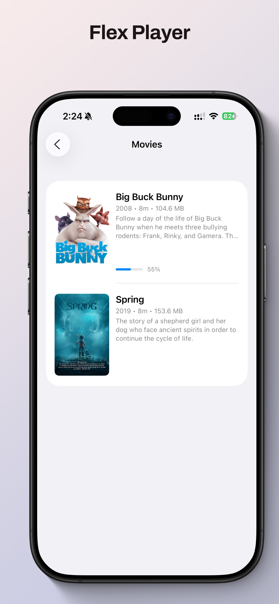
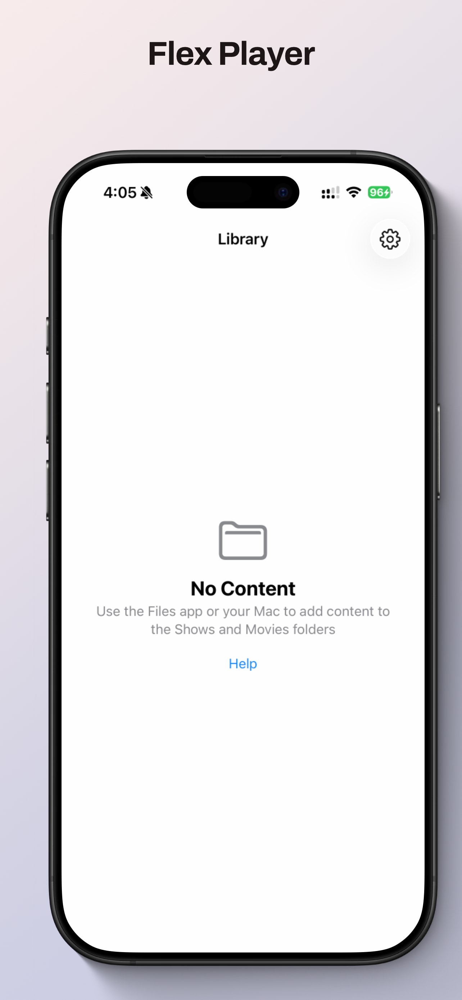
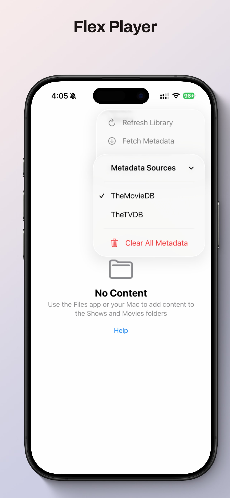
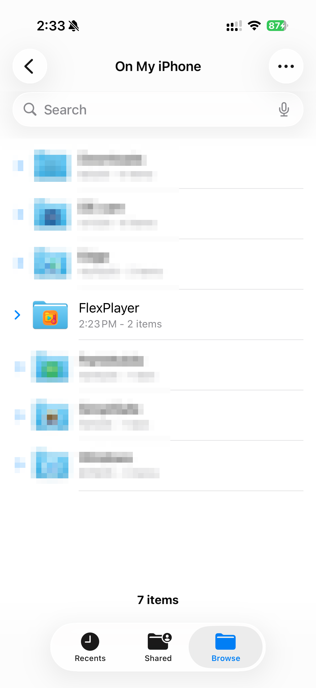
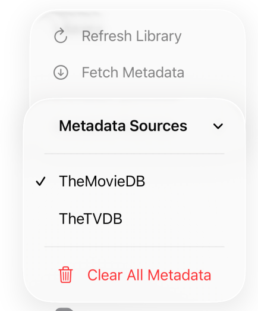

<picture>
  <source srcset="Documentation/icon-dark.png" media="(prefers-color-scheme: dark)">
  <source srcset="Documentation/icon-light.png" media="(prefers-color-scheme: light)">
  
</picture>
  

Simple & Native Offline Video Playback with beautiful metadata. 

## 🖥️ Screenshots

    
    
    

## 🧠 How it works

Open the Files app and drop content into the corresponding folders, or do it via the Mac.

    

Then open the app, and hit "Fetch Metadata" to get posters and content details.

    

## 🖥️ Install & Minimum Requirements

- iOS / iPadOS 17.0 or later  

### ⚙️ Installation

<a href="https://apps.apple.com/us/app/flex-player/id6754710574">App Store</a>

## 📝 Changelog

### 1.0.1
- Added an intro Tutorial / Help.

### 1.0.0 
- Initial Release. 

## 📄 License

MIT — free for personal and commercial use. 

## Privacy
<a href="Documentation/PrivacyPolicy.html">Privacy Policy</a>

## Support 
<a href="Documentation/Support.html">Support</a>